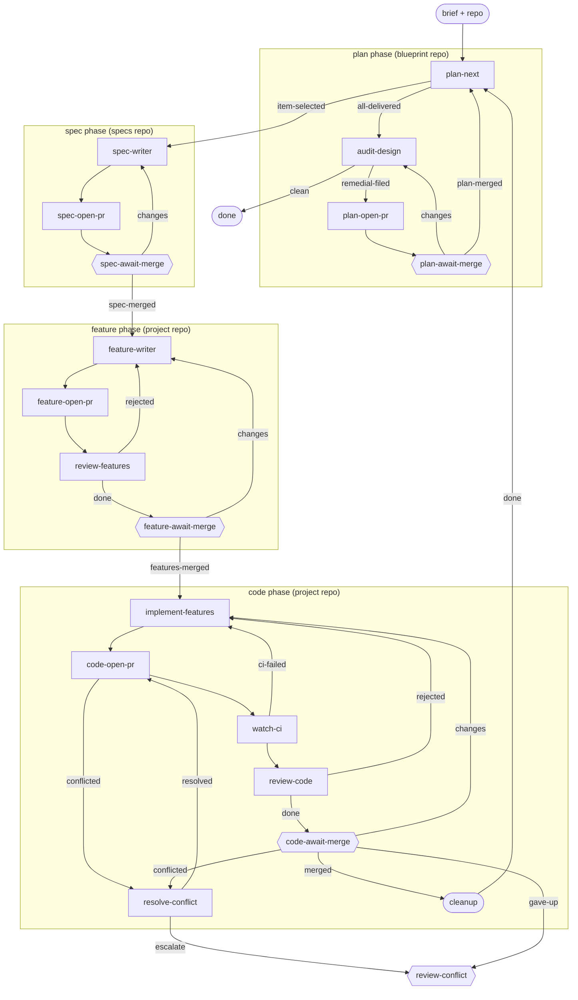

# blueprint-delivery

**Delivers a whole Blueprint's `plan/` as one item, by looping.** A Blueprint holds a frozen design plus a living `plan/` of work items. Instead of filing one `lc` item per work item by hand, this workflow files one item - "deliver &lt;blueprint&gt;" - and loops: each pass reads the plan and the built codebase, picks the next undelivered work item, and carries it through a spec/feature/code arc - a spec is written and merged, gherkin scenarios are derived from it and merged, then code is implemented to turn every scenario green and merged. Once that pass's code PR merges, `cleanup` tears down just that pass's worktree and loops back to pick the next item, rather than closing the item. Only once nothing remains does `audit-design` adversarially assess the whole built system against the whole design - not just the item last delivered - and either files remedial work back into `plan/` (routed through a fourth PR the human reviews) or finds the design holds and closes the item.

**Use it when** you have a Blueprint's design frozen and its `plan/` written, and want the whole plan delivered under one item instead of driving each work item's filing by hand.

**Phases:** `spec` (specs repo), `feature` and `code` (project repo), and a fourth `plan` phase (the Blueprint repo) shared by `plan-next`, `audit-design`, `plan-open-pr` and `plan-await-merge` - every owned stage needs a phase for the graph to compose. `plan-next` is handed the phase's worktree but never uses it: it only reads the Blueprint repo and the target codebase, never commits, and never opens a PR - only `audit-design`'s `remedial-filed` outcome does that.

The graph is `workflows/blueprint-delivery.md`; the role prompts are in `steps/*.md`. `spec-writer`, `open-pr`, `await-merge`, `feature-writer`, `review-features`, `implement-features`, `watch-ci`, `review-code`, `resolve-conflict`, `review-ci`, and `handle-feedback` are generic PR/CI machinery, reused unchanged across the spec, feature and code phases. `plan-next`, `audit-design`, and `cleanup` are this workflow's own.

## Flow

Node shape shows who runs each stage: `[ agent-step ]` an ephemeral agent claims and completes it; `{{ human-gate }}` a human decides (the driver assists); `([ start / terminal ])` the item's inputs or where the flow ends. Edge labels are outcomes; edges back to an earlier stage are rework loops. Merge, CI-failure, and conflict transitions are driven by engine hooks watching the PR - folded into the labelled edges here; exact wiring is in the graph file.

## Steps

| Step | Who | Does |
| --- | --- | --- |
| `plan-next` | agent | Reads the Blueprint's `plan/` and the codebase at `origin/main` to decide what is genuinely undelivered; names the next work item (never accumulating - each pass replaces it) and routes into the spec/feature/code arc, or into the design audit once nothing remains. Shares the `plan` phase's worktree but never uses it - it never commits and never opens a PR. |
| `spec-writer` -> `spec-await-merge` | agent / human | Formalizes the selected work item into a spec, opens the spec PR, human reviews and merges. |
| `feature-writer` -> `feature-await-merge` | agent / human | Derives `@wip` gherkin scenarios from the merged spec, opens the feature PR, an agent primes the human's review. |
| `implement-features` -> `code-open-pr` -> `watch-ci` -> `review-code` -> `code-await-merge` | agent / agent / agent / agent / human | Code and step defs to turn every scenario green, code PR, CI, review, human merge. |
| `cleanup` | you + driver | Tears down this pass's code-phase worktree/branch and continues the loop back to `plan-next` - does not close the item. |
| `audit-design` | agent | Runs only once `plan-next` finds nothing left. Adversarially assesses the built system against the whole Blueprint design and writes any remedial work items into `plan/`. |
| `plan-open-pr` -> `plan-await-merge` | agent / human | The Blueprint PR: opens a PR for whatever `audit-design` wrote to `plan/`, human reviews and merges (or requests changes, routing back to `audit-design`). |
| `done` | terminal | The Blueprint is fully delivered and the audit found nothing left to remedy. |
